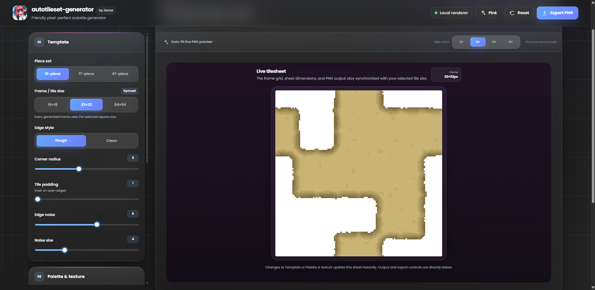
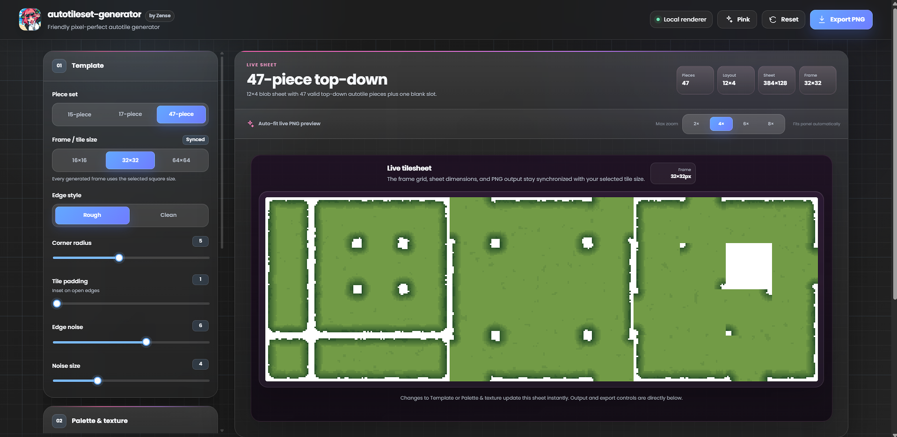
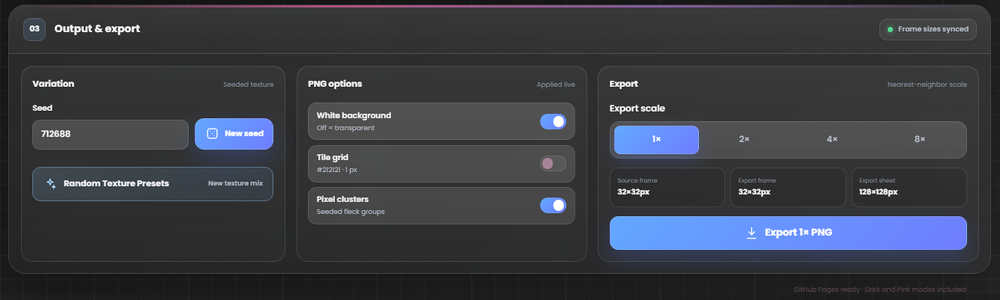

# autotileset-generator

**Made by Zense**

A modern, local-first pixel autotile generator built with React, TypeScript, Vite, and HTML Canvas. It creates 15-piece, 17-piece, and 47-piece top-down tilesets with a single live export preview.

## Preview

### Autotileset Generator

<p align="center">
  
</p>

### 47-Piece Autotileset

<p align="center">
  
</p>

### Output & Export

<p align="center">
  
</p>

## Features

- 15-piece top-down autotile template
- 17-piece top-down autotile template
- 47-piece top-down blob/autotile template
- 16x16, 32x32, and 64x64 tile sizes
- Rough and clean edge styles
- Corner radius, padding, edge noise, noise size, shades, edge fade, texture noise, and flecks
- 6 terrain palette presets
- 9 texture presets
- Deterministic seed input and **Generate Seeds** button
- Exact live tilesheet preview
- 1x / 2x / 4x / 8x nearest-neighbor PNG export
- Two saved UI themes: **Dark** (`#212121` linear gradient) and **Pink** (`#FFC0CB` linear gradient)
- Translucent React UI with glass-like cards, adaptive Dark/Pink buttons, soft linear gradients, and Poppins
- Runs locally with no backend
- Ready for GitHub Pages


## UI style

The interface uses a friendly **pixel-tool / modern SaaS hybrid** style with translucent glass panels and a smoothly drifting background grid. The app now has two themes only:

- **Dark mode** — anchored on `#212121` with a charcoal linear gradient and cool blue controls.
- **Pink mode** — anchored on `#FFC0CB` with a soft rose linear gradient and pink controls.

The old light mode has been removed.

## Project structure

```text
autotileset-generator/
├── .github/
│   └── workflows/
│       └── pages.yml
├── resources/
│   ├── README.md
│   ├── examples/
│   └── screenshots/
├── react-source/
│   ├── src/
│   │   ├── generator.ts
│   │   ├── main.tsx
│   │   └── styles.css
│   ├── index.html
│   ├── package.json
│   ├── tsconfig.json
│   └── vite.config.ts
├── vendor/
├── app.js
├── styles.css
├── index.html
├── LICENSE
├── THIRD_PARTY_NOTICES.md
├── .gitignore
├── .nojekyll
└── README.md
```

## Run locally

The repository root is already a ready-to-run static build. Extract it and open:

```text
index.html
```

No backend or local server is required.

For React + TypeScript development:

```bash
cd react-source
npm install
npm run dev
```

Build the development source with:

```bash
npm run build
```

## GitHub Pages

The project includes `.github/workflows/pages.yml` for GitHub Pages deployment.

1. Push this folder to a GitHub repository.
2. Open **Settings → Pages**.
3. Set **Source** to **GitHub Actions**.
4. Push to `main`, or run the Pages workflow manually.

The ready-to-run root files are deployed directly, so no build step is required for Pages.

## Resources

Use `resources/` for repository screenshots, example tileset exports, documentation images, social preview graphics, or future preset resources.

## Credits

Made by **Zense**.

The 15-piece layout and 17-piece guide structure/rendering approach were adapted from SpriteCook's open-source `spritecook-tileset-gen` project under the MIT License. See `THIRD_PARTY_NOTICES.md`.

## Included presets

Color palettes:

| Preset | Base | Edge | Accent / Grass / Water |
| --- | --- | --- | --- |
| Meadow | `#78AE3D` | `#2F642D` | `#9AD556` |
| Earth | `#B18148` | `#60452F` | `#D39A5E` |
| Stone | `#7C858C` | `#414B52` | `#A8B1B6` |
| Ocean | `#4B89A4` | `#28546A` | `#72B6D0` |
| Sand | `#C9B476` | `#7B673A` | `#E0CE91` |
| Frost | `#B9D8DE` | `#708FA0` | `#E4F6F8` |

Texture presets: **Smooth · Grainy · Rocky · Organic · Spikey · Cracked · Mossy · Chunky · Layered**.

- The interface now shows a single **Live Tilesheet** preview that matches the exported PNG.

## v7 grid + Spikey refinement

- Tile grid is now **off by default**.
- When enabled, it uses a **1 px `#212121` grid overlay**. The grid remains off by default.
- Grid lines no longer add extra pixels to the native sheet dimensions.
- **Spikey** is now sharper and more aggressive again, with stronger edge variation and a pointier silhouette, while still avoiding detached floating pixels.

## v10 stability and responsiveness fix

- Range sliders now update through animation-frame batching, so dragging feels smoother and the preview does not try to redraw multiple expensive frames at once.
- Slider input uses live `input` events for immediate feedback while dragging.
- Edge noise is now topology-safe across the 15-piece, 17-piece, and 47-piece generators: rough presets can carve a shallow inside edge, but they cannot create pixels outside the base land mask.
- This prevents detached/floating edge, dirt, grass, texture, or shading pixels when changing texture presets, color presets, seeds, or edge-noise settings.


## Logo resource

- `resources/zense-logo.png` stores the Zense app/logo image used by the UI brand mark.


## v13 Dark + Pink translucent UI

- Removed the previous Light mode. The theme switch now toggles only **Dark** and **Pink**.
- Dark mode uses a `#212121`-based charcoal linear gradient.
- Pink mode uses a `#FFC0CB`-based rose linear gradient.
- Cards, headers, controls, and preview surfaces stay translucent with backdrop blur.
- Buttons, sliders, segmented controls, and toggles adapt their accent colors to the active theme.
- The page background includes a subtle pixel-grid pattern that drifts smoothly over time.
- The moving-grid animation respects `prefers-reduced-motion`.
